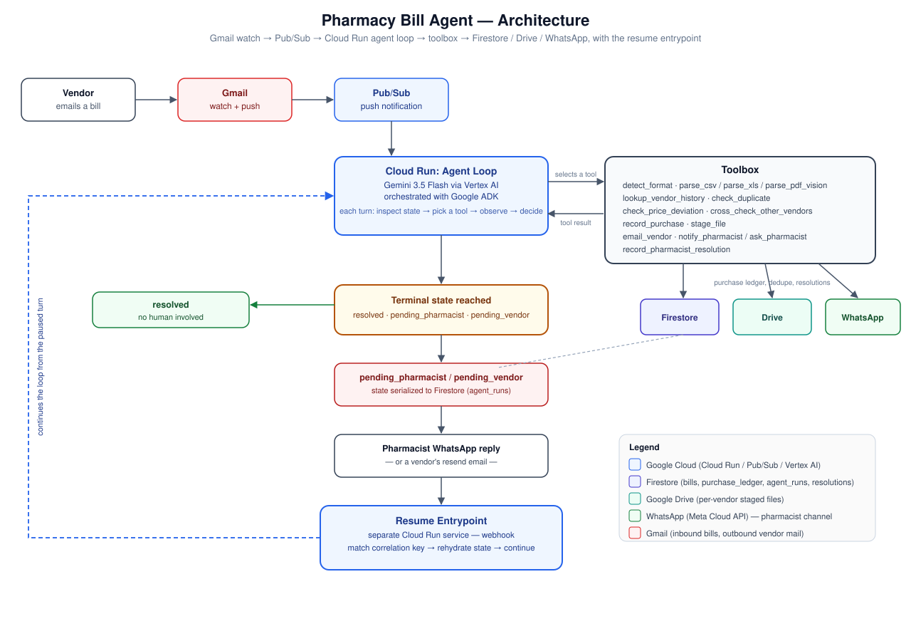

# Pharmacy Bill Agent

An autonomous agent that takes a pharmacy's incoming purchase bills — real
vendor CSV/XLS/PDF exports, three different formats, none of them clean —
and processes them end to end with no human involvement on the common path:
parses the bill, checks it against purchase history, disputes a confirmed
overcharge with the vendor, stages the verified file for the pharmacist's
existing billing software, and only asks a human when it's genuinely unsure.
Built for the **All Things Agentic Hackathon**; see
[`pharmacy_bill_agent_prd_v3.md`](pharmacy_bill_agent_prd_v3.md) for the full
product spec and [`tasks.md`](tasks.md) for build history.

Reasoning is Gemini 3.5 Flash via Vertex AI, orchestrated with Google's
Agent Development Kit (ADK). Infra is Cloud Run, Firestore, Pub/Sub, Google
Drive, Gmail, Secret Manager, and Cloud Trace/Logging, all on GCP.

## Architecture



Gmail watch → Pub/Sub push → a Cloud Run agent loop that reasons turn by
turn over a toolbox (parse, dedupe, check price history, cross-check other
vendors, record, stage, email, WhatsApp) → a terminal state
(`resolved` / `pending_pharmacist` / `pending_vendor`). A pending run
serializes its state to Firestore; a later WhatsApp reply or vendor resend
email hits a **separate resume entrypoint** (same Cloud Run service, a
different route) that rehydrates the run and continues the loop from the
turn it paused on — see PRD §7.6.

## Repository layout

```
src/pharmacy_agent/   application code (formats/, agent/, and top-level modules)
tests/                pytest suite (unit + live integration against real GCP)
scripts/              one-off/operational scripts (OAuth setup, seeding, Gmail watch)
samples_sanitized/    real vendor sample bills with PII scrubbed (committed)
samples/              raw vendor samples with real PII (gitignored, not committed)
docs/                 architecture diagram and other submission assets
```

## Prerequisites

- Python 3.11+
- A GCP project with billing enabled
- [`gcloud` CLI](https://cloud.google.com/sdk/docs/install), authenticated with
  both `gcloud auth login` (for `gcloud` commands) and
  `gcloud auth application-default login` (Application Default Credentials —
  what the Firestore/Vertex AI Python client libraries actually use, both
  locally and in the test suite)
- A Gmail account you're willing to use as the bill-intake inbox (personal
  Gmail works — this project uses OAuth user consent, not domain-wide
  delegation, since it targets a personal account)
- A [Meta developer app](https://developers.facebook.com/) with the
  WhatsApp product added (a free Test WhatsApp Business Account is enough)

## 1. GCP project setup

```bash
gcloud config set project YOUR_PROJECT_ID

gcloud services enable \
  aiplatform.googleapis.com \
  gmail.googleapis.com \
  drive.googleapis.com \
  run.googleapis.com \
  firestore.googleapis.com \
  pubsub.googleapis.com \
  cloudscheduler.googleapis.com \
  cloudtrace.googleapis.com \
  logging.googleapis.com \
  secretmanager.googleapis.com

gcloud firestore databases create --location=asia-south1 --type=firestore-native
```

Pick whatever region you like; `asia-south1` is just what this build used.

### Service account (for Cloud Run)

```bash
gcloud iam service-accounts create pharmacy-agent-sa

PROJECT_ID=$(gcloud config get-value project)
for ROLE in aiplatform.user datastore.user pubsub.editor \
            secretmanager.secretAccessor logging.logWriter cloudtrace.agent run.invoker; do
  gcloud projects add-iam-policy-binding "$PROJECT_ID" \
    --member="serviceAccount:pharmacy-agent-sa@${PROJECT_ID}.iam.gserviceaccount.com" \
    --role="roles/${ROLE}"
done
```

No project-editor role — Gmail/Drive access goes through the pharmacist's
own OAuth consent below, not this service account (a personal Gmail account
can't grant domain-wide delegation to it anyway).

### OAuth client (for Gmail + Drive)

1. In [Google Auth Platform](https://console.cloud.google.com/auth), configure
   the OAuth consent screen and publish it to **Production** (a Testing-mode
   app's refresh tokens expire every 7 days).
2. Add scopes: `gmail.readonly`, `gmail.send`, `drive`.
3. Create a **Desktop app** OAuth client, download its JSON, save it as
   `credentials.json` in the repo root (gitignored — never commit it).

## 2. Local setup

```bash
python -m venv .venv
# Windows
.venv\Scripts\activate
# macOS/Linux
source .venv/bin/activate

pip install -r requirements.txt
```

Mint the Gmail/Drive refresh token and push it straight to Secret Manager
(never printed to stdout):

```bash
python scripts/gmail_oauth_setup.py
```

This also needs a `gmail-oauth-client` secret holding the same OAuth
client's `client_id`/`client_secret` (Cloud Run has no local file to read
`credentials.json` from):

```bash
python -c "import json; print(json.dumps({k: json.load(open('credentials.json'))['installed'][k] for k in ('client_id','client_secret')}))" \
  | gcloud secrets create gmail-oauth-client --data-file=-
```

### Secrets this project reads from Secret Manager

| Secret ID | How it's created |
|---|---|
| `gmail-refresh-token` | `scripts/gmail_oauth_setup.py` (above) |
| `gmail-oauth-client` | manually, from `credentials.json` (above) |
| `meta-whatsapp-access-token` | Meta App Dashboard → WhatsApp → API Setup — copy the temporary (or permanent, once you have a system user) access token |
| `meta-whatsapp-app-secret` | Meta App Dashboard → Settings → Basic |
| `meta-whatsapp-webhook-verify-token` | any string you choose — you'll enter the same value in Meta's webhook config below ("Wire up the WhatsApp webhook") |

```bash
echo -n "PASTE_VALUE" | gcloud secrets create SECRET_ID --data-file=-
# on Windows PowerShell, pipe through a variable rather than echo -n to
# avoid a trailing CRLF landing in the secret value:
# $v = "PASTE_VALUE"; [IO.File]::WriteAllText("$env:TEMP\s.txt", $v)
# gcloud secrets create SECRET_ID --data-file="$env:TEMP\s.txt"
```

### Seed data

```bash
python scripts/seed_purchase_ledger.py
```

Loads the real sanitized sample invoices into `purchase_ledger`
(`seeded=false`), plus clearly-labelled synthetic price history
(`seeded=true`) needed for the price-deviation/dispute demo path — see PRD
§10 for why synthetic history is always flagged rather than presented as
observed. Safe to re-run (idempotent).

```bash
PLACEHOLDER_EMAIL=you@example.com \
PHARMACIST_WHATSAPP_NUMBER=15551234567 \
python scripts/seed_vendor_directory.py
```

Seeds the trusted vendor/pharmacist contact directory that `email_vendor`
and `notify_pharmacist`/`ask_pharmacist` resolve recipients from — **never**
from a parsed document, so a malformed vendor file can't redirect where the
agent sends anything (PRD §7.10). Real vendor addresses aren't known yet
(open item, see `tasks.md` T12/T13), so every entry points at
`PLACEHOLDER_EMAIL` until real ones are available.

### Running tests

```bash
pytest
```

Most of this suite is **live** — it hits real Firestore, real Vertex AI
(Gemini), and (for a couple of opt-in tests) real Gmail sends, rather than
mocking GCP. That's deliberate: the PRD's whole premise is real formats and
real infra, not a mocked happy path. Set `TEST_GMAIL_ADDRESS` to your own
address to also run the tests that send real email. Expect a full run to
take 15–20 minutes.

## 3. Cloud deploy

```bash
gcloud run deploy pharmacy-bill-agent \
  --source . \
  --region asia-south1 \
  --service-account "pharmacy-agent-sa@${PROJECT_ID}.iam.gserviceaccount.com" \
  --allow-unauthenticated \
  --set-env-vars "GOOGLE_CLOUD_PROJECT=${PROJECT_ID},META_WHATSAPP_PHONE_NUMBER_ID=YOUR_PHONE_NUMBER_ID,PUBSUB_PUSH_AUDIENCE=YOUR_SERVICE_URL"
```

`--allow-unauthenticated` is deliberate: the judge-facing `/status` page
(§7.11) needs to be reachable without GCP IAM access, and `/pubsub/push` and
`/whatsapp/webhook` each independently verify their caller in application
code (Pub/Sub's OIDC bearer token / Meta's HMAC signature) rather than
relying on the Cloud Run IAM layer — see `app.py`.

`PUBSUB_PUSH_AUDIENCE` is the service's own URL (fill it in once you know
it — a first deploy without it, then a redeploy with it, is fine; the
service will just skip push-auth verification locally/without it set).

### Environment variables

| Variable | Required | Purpose |
|---|---|---|
| `GOOGLE_CLOUD_PROJECT` | yes (Cloud Run sets a similar var automatically, but scripts run locally need it explicitly) | GCP project id |
| `META_WHATSAPP_PHONE_NUMBER_ID` | yes | Meta Cloud API phone number id (not sensitive — the access token is) |
| `PUBSUB_PUSH_AUDIENCE` | recommended in prod | verifies inbound Pub/Sub push requests are genuine |
| `DISPUTE_REQUIRES_APPROVAL` | no (default `false`) | intended to gate autonomous vendor disputes behind a pharmacist approval step instead of sending immediately (PRD §7.5); the flag exists and defaults `false` for the hackathon demo, but its `true` branch has no caller wired into the agent loop yet — setting it currently has no effect (see `tasks.md` T40/T43) |
| `PHARMACY_AGENT_GEMINI_MODEL` | no (default `gemini-3.5-flash`) | override the reasoning/vision model |

### Wire up the Gmail watch

Pub/Sub needs a topic Gmail is allowed to publish to, and Cloud Run needs a
push subscription pointed at it:

```bash
gcloud pubsub topics create gmail-notifications
gcloud pubsub topics add-iam-policy-binding gmail-notifications \
  --member=serviceAccount:gmail-api-push@system.gserviceaccount.com \
  --role=roles/pubsub.publisher

gcloud iam service-accounts create pubsub-push-invoker
gcloud run services add-iam-policy-binding pharmacy-bill-agent \
  --region=asia-south1 \
  --member="serviceAccount:pubsub-push-invoker@${PROJECT_ID}.iam.gserviceaccount.com" \
  --role=roles/run.invoker

SERVICE_URL=$(gcloud run services describe pharmacy-bill-agent --region asia-south1 --format 'value(status.url)')
gcloud pubsub subscriptions create gmail-notifications-push \
  --topic=gmail-notifications \
  --push-endpoint="${SERVICE_URL}/pubsub/push" \
  --push-auth-service-account="pubsub-push-invoker@${PROJECT_ID}.iam.gserviceaccount.com"
```

Then register the watch itself and seed the Firestore watermark it needs
(run this once after every deploy, and again whenever the watch expires —
Gmail watches expire after ~7 days):

```bash
python scripts/start_gmail_watch.py
```

### Wire up the WhatsApp webhook

1. In the Meta App Dashboard, under WhatsApp → Configuration, set the
   **Callback URL** to `${SERVICE_URL}/whatsapp/webhook` and the
   **Verify token** to the same value you stored in the
   `meta-whatsapp-webhook-verify-token` secret.
2. Subscribe to the `messages` webhook field.
3. Note WhatsApp's 24-hour business-initiated-messaging window: a template
   message the agent sends doesn't open two-way messaging on its own — the
   recipient (the pharmacist) has to reply at least once first.

## Verifying it worked

- `GET ${SERVICE_URL}/health` → `{"status": "ok"}`
- `GET ${SERVICE_URL}/status` → the judge-facing status page (PRD §7.11):
  every bill the agent has processed, its vendor/timestamp/status, and a
  link to its Cloud Trace reasoning chain
- Send a test email with a sample bill attached (see `samples_sanitized/`)
  to the Gmail account the watch is registered on, and watch a `bills` doc
  and `purchase_ledger` docs appear in Firestore within seconds

## Known limitations

See `pharmacy_bill_agent_prd_v3.md` §14 (Open Questions) and `tasks.md` for
the full list. The two that matter most for a real deployment: real daily
bill volume/vendor count are still unknown (needs the pharmacist's own
numbers), and price-deviation detection currently runs on synthetic,
clearly-labelled history rather than real observed price drift, since no
item repeats across two invoices in the current sample set.
